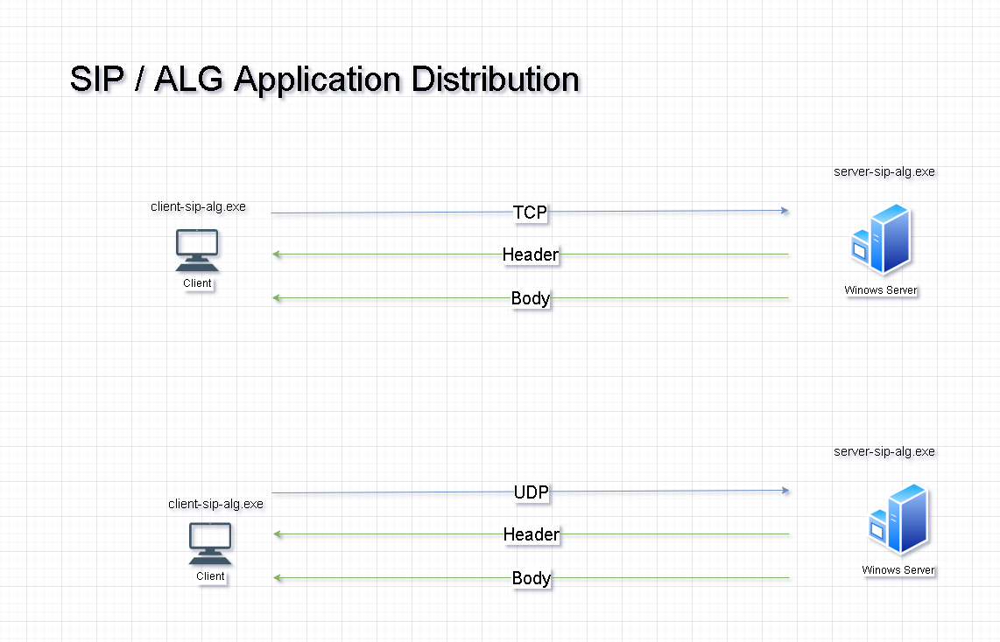
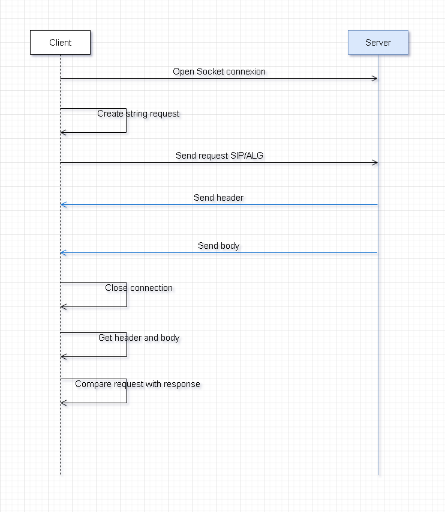

# SIP-ALG-Detector c#

SIP-ALG-Detector is an utility to detect routers with SIP ALG enabled. It comes with a client and a server:

The client is executed in a host into the private LAN.
The server runs in a server with public IP.
Both the client and the server and written in c# language.

Base on the existing project on Ruby
[Git Repository](https://github.com/ibc/sip-alg-detector)

## Server

1. Serilog library
2. TCP implementation
3. UDP implementation
4. xUnit project to test.
5. Install the server as a windows service.
   - Build the server project with Release configuration
   - Copy the files to the install folder
   - Example sip-alg-detectors-csharp\server\deploy-server-as-windows
   - To install the application as a windows service
     server-si-alg-windows-service.exe install start
   - To uninstall
     server-si-alg-windows-service.exe uninstall

## Diagram

# Process

## About SIP ALG

Many of today's commercial routers implement SIP ALG, coming with this feature enabled by default.

An ALG (Application-level gateway) understands the protocol used by the specific applications that it supports (in this case SIP) and does a protocol packet-inspection of traffic through it. A NAT router with a built-in SIP ALG can re-write information within the SIP messages (SIP headers and SDP body) making signaling and audio traffic between the client behind NAT and the SIP endpoint possible. While ALG could help in solving NAT related problems, the fact is that most of the routers ALG implementations are wrong and break SIP.

More information about SIP ALG in [Voip-Info.org](http://www.voip-info.org/wiki/view/Routers+SIP+ALG).
